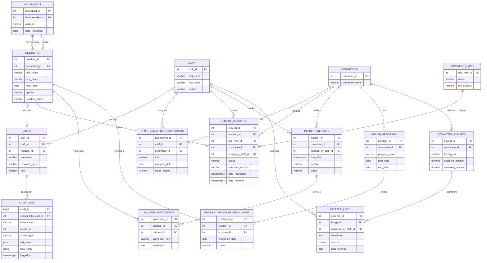

# BMIMS: Barangay Mahayag Integrated Management System

**Course:** Advanced Database Systems (3rd-year IT)
**Theme:** Enterprise Resource Planning (ERP) core for local governance
**Database:** PostgreSQL 18 hosted on Neon (Singapore region, no localhost)
**Backend:** Node.js 24, Express, Prisma 7 (TypeScript)
**Repository:** `jamesautintecosison-prog/bmims-backend`

> **Status note.** This document describes what is implemented in the repository. Sections marked **PENDING** (benchmark results, backup/restore evidence, front-end) are not finished yet and contain no invented figures. Update them as the work is completed.

---

## Table of contents

1. System overview
2. Architecture
3. Database design
4. Data dictionary
5. Referential integrity rules
6. Server-side automation (triggers and stored procedures)
7. Security model
8. API reference
9. Setup guide
10. Testing and verification
11. Optimization and benchmarking (PENDING)
12. Git workflow
13. Design decisions and deviations from the proposal
14. Defense preparation notes
15. Known limitations and remaining work

---

## 1. System overview

### 1.1 Problem

Barangay-level governance usually runs on paper logs and spreadsheets. That produces duplicate and inconsistent resident records, no verifiable trail of who issued or changed a certificate, no protection against a committee overspending its budget when several expenses are logged at once, and no structural boundary stopping one person from viewing another's data.

### 1.2 Solution

BMIMS keeps resident, household, committee, request, incident, program and budget data in a Third-Normal-Form relational schema. The business rules that must never be wrong (budget deduction, audit logging, certificate issuing, incident filing) live inside the database as triggers and stored functions, not in application code. Access is limited by database roles and row-level security, so each user tier sees only its own data even if the application has a bug.

### 1.3 User tiers

| Tier | Database role | Capabilities |
|---|---|---|
| **Admin** (Punong Barangay, Secretary) | `admin_role` | Full CRUD on business tables; reads the audit log; approves budgets; can issue any certificate and file incidents for any committee. |
| **Staff** (Kagawad, committee tier) | `staff_role` | Reads residents and reference data; works only on service requests, incidents, enrollments, budgets and expenses of the committees they are assigned to; issues certificates and files incidents for those committees. |
| **Resident** (client) | `resident_role` | Sees only their own record, household, requests, enrollments and incidents they are a party to; submits requests; files incidents as a complainant. |

A fourth role, `auth_role`, exists only to look up a user's password hash at login (SELECT on `users`, nothing else).

---

## 2. Architecture

### 2.1 Layers

```
Client (React UI, PENDING)  or  curl / PowerShell
        |  JSON over HTTP
        v
Express API
  routes        -> map URLs to controllers
  middleware    -> authenticate (JWT), error handler
  controllers   -> validate input (Zod), shape responses
  repositories  -> the ONLY layer that talks to the database (Prisma)
        |  one transaction per request, role chosen by tier
        v
PostgreSQL on Neon
  role privileges + row-level security + triggers + stored functions
```

There is no HTML and no query logic in the same file. Controllers never build SQL; repositories never read the HTTP request.

### 2.2 Request lifecycle (example: issue a certificate)

1. The client sends `POST /api/service-requests/12/issue` with `Authorization: Bearer <token>`.
2. `authenticate` verifies the JWT signature and expiry, then sets the request context: tier, user id, staff id or resident id (all taken from the signed token, never from client input).
3. The route calls the controller, which validates the id with Zod.
4. The repository calls `withRequestContext`, which opens **one transaction** on the Prisma client for the caller's tier (`admin_role`, `staff_role` or `resident_role` connection) and runs `set_config('app.user_id' | 'app.staff_id' | 'app.resident_id', value, true)`. The `true` makes the value transaction-local, so it cannot leak to another request on a pooled connection.
5. Inside the same transaction it runs `SELECT sp_issue_certificate($1::int)` (a bound parameter, not string concatenation).
6. The function checks authorization, status and eligibility, takes a lock, numbers the certificate and updates the row.
7. The audit trigger fires on that UPDATE and writes old/new values plus `app.user_id` into `audit_logs`.
8. The transaction commits (or rolls back everything on any error). The controller returns `{ request_id, reference_number }`.

### 2.3 Project structure

```
bmims-backend/
  database/
    migrations/      001-008 .sql files, run in order
    seeds/           001_seed_sample_data.sql
  docs/              this documentation, ERD, benchmark report
  server/
    prisma/schema.prisma      introspected from the live database
    prisma7.config.ts         Prisma CLI config (owner URL, CLI only)
    src/
      config/env.ts           reads .env (never the owner URL)
      db/prismaClients.ts     one client per role (+ auth client)
      db/withRequestContext.ts  per-request transaction + session values
      middleware/             authenticate.ts, errorHandler.ts
      modules/                auth, residents, serviceRequests, incidents,
                              expenses, budgets, auditLogs, shared (CRUD factory)
      scripts/createUser.ts   creates login accounts (bcrypt)
      utils/                  asyncHandler, httpError, pagination, serialization
      app.ts, server.ts
  client/            React UI (PENDING)
  .env.example       placeholder connection strings (committed)
  .env               real secrets (git-ignored)
```

---

## 3. Database design

### 3.1 Entity summary (15 tables)

| Group | Tables |
|---|---|
| Identity and people | `households`, `residents`, `staff`, `users` |
| Organization | `committees`, `staff_committee_assignments` (M:N) |
| Services | `document_types`, `service_requests` |
| Incidents | `incident_reports`, `incident_participants` (M:N) |
| Programs | `health_programs`, `resident_program_enrollment` (M:N) |
| Finance | `committee_budgets`, `expense_logs` |
| Audit | `audit_logs` |

### 3.2 Many-to-many junctions with intersection attributes

| Junction | Connects | Intersection attributes |
|---|---|---|
| `staff_committee_assignments` | staff and committees | `role`, `assigned_date`, `hours_logged` |
| `incident_participants` | incidents and residents | `participant_role` (complainant / respondent / witness), `statement` |
| `resident_program_enrollment` | residents and health programs | `enrollment_date`, `status` |

### 3.3 Entity-relationship diagram



### 3.4 Third Normal Form

- Every table has a single-column surrogate primary key (`GENERATED ALWAYS AS IDENTITY`), and every non-key column depends on that key only.
- Repeated text is moved into its own table: document types, committees, programs and staff are referenced by id, never copied into requests or incidents.
- Credentials are separated from profile data: `users` holds the login, while `residents` and `staff` hold the person. A `users` row belongs to exactly one staff member or one resident.
- Many-to-many relationships are resolved with dedicated junction tables that carry their own attributes (section 3.2).
- Fixed value sets (status, role, gender) are enforced with `CHECK` constraints rather than free text.
- Nullable columns are limited to values that are genuinely unknown at creation: `reference_number`, `issued_by_staff_id` and `date_released` (set only on release), `handled_by_staff_id` (set when a case is picked up), `end_date`, `contact_number`, optional descriptions, and `household_id` (a resident can be outside any household).

**Deliberate derived column:** `committee_budgets.remaining_amount` equals `allocated_amount` minus the sum of expenses. It is kept as a stored value on purpose, so overspending can be rejected with one atomic comparison instead of summing every expense. Only the expense trigger changes it, and `CHECK` constraints keep it between 0 and `allocated_amount`.

### 3.5 Migration scripts (run in order)

| File | Purpose |
|---|---|
| `001_create_core_tables.sql` | households, residents, staff, committees, document_types, users |
| `002_create_operational_tables.sql` | assignments, service_requests, incident_reports, incident_participants, health_programs, enrollment |
| `003_create_budget_and_audit_tables.sql` | committee_budgets, expense_logs, audit_logs |
| `004_create_roles_and_grants.sql` | `admin_role`, `staff_role`, `resident_role` and table privileges (no passwords) |
| `005_enable_row_level_security.sql` | session helper functions, RLS on 8 tables, policies per role |
| `006_create_auth_role.sql` | `auth_role` with SELECT on `users` only |
| `007_create_triggers.sql` | budget deduction trigger, audit triggers |
| `008_create_stored_procedures.sql` | `sp_issue_certificate`, `sp_file_incident_report`, grants, removal of direct incident inserts |
| `009_...` | PLANNED: performance indexes chosen from `EXPLAIN ANALYZE` results |

Seed data: `database/seeds/001_seed_sample_data.sql` (8 residents in 3 households, 4 staff, 3 committees, 4 requests, 2 incidents, 3 programs, 3 budgets). It does not create login accounts; accounts are created by `npm run create-user`, which stores a bcrypt hash.

---

## 4. Data dictionary

Types are PostgreSQL types. "PK" = primary key (identity), "FK" = foreign key.

### 4.1 households
| Column | Type | Null | Default / constraint | Notes |
|---|---|---|---|---|
| household_id | INT | no | PK, identity | |
| head_resident_id | INT | yes | FK to residents, ON DELETE SET NULL | Household head; added after `residents` exists |
| address | VARCHAR(255) | no | | |
| date_registered | DATE | no | CURRENT_DATE | |

### 4.2 residents
| Column | Type | Null | Default / constraint | Notes |
|---|---|---|---|---|
| resident_id | INT | no | PK, identity | |
| household_id | INT | yes | FK to households, ON DELETE SET NULL | |
| first_name, last_name | VARCHAR(60) | no | | |
| birth_date | DATE | no | CHECK not in the future | |
| gender | VARCHAR(10) | no | CHECK Male, Female, Other | |
| contact_number | VARCHAR(20) | yes | | |
| resident_status | VARCHAR(20) | no | 'Active'; CHECK Active, Inactive, Transferred, Deceased | Only Active residents can receive certificates |

### 4.3 staff
| Column | Type | Null | Default / constraint | Notes |
|---|---|---|---|---|
| staff_id | INT | no | PK, identity | |
| first_name, last_name | VARCHAR(60) | no | | |
| position | VARCHAR(60) | no | | e.g. Punong Barangay, Kagawad - Health |
| date_hired | DATE | no | CURRENT_DATE | |

### 4.4 committees
| Column | Type | Null | Default / constraint | Notes |
|---|---|---|---|---|
| committee_id | INT | no | PK, identity | |
| committee_name | VARCHAR(100) | no | UNIQUE | |
| description | TEXT | yes | | |

### 4.5 document_types
| Column | Type | Null | Default / constraint | Notes |
|---|---|---|---|---|
| doc_type_id | INT | no | PK, identity | |
| name | VARCHAR(100) | no | UNIQUE | |
| description | TEXT | yes | | |
| fee_amount | NUMERIC(10,2) | no | 0; CHECK >= 0 | |

### 4.6 users
| Column | Type | Null | Default / constraint | Notes |
|---|---|---|---|---|
| user_id | INT | no | PK, identity | |
| staff_id | INT | yes | UNIQUE; FK to staff, RESTRICT | |
| resident_id | INT | yes | UNIQUE; FK to residents, RESTRICT | |
| username | VARCHAR(50) | no | UNIQUE | |
| password_hash | VARCHAR(255) | no | | bcrypt, cost 12 |
| role | VARCHAR(20) | no | CHECK admin, staff, resident | |
| created_at | TIMESTAMPTZ | no | now() | |

Table constraints: `chk_users_one_owner` (exactly one of `staff_id` / `resident_id` is set) and `chk_users_role_matches_owner` (role `resident` needs `resident_id`; roles `admin` and `staff` need `staff_id`).

### 4.7 staff_committee_assignments (junction)
| Column | Type | Null | Default / constraint | Notes |
|---|---|---|---|---|
| assignment_id | INT | no | PK, identity | |
| staff_id | INT | no | FK to staff, RESTRICT | |
| committee_id | INT | no | FK to committees, RESTRICT | |
| role | VARCHAR(30) | no | 'Member'; CHECK Chairperson, Secretary, Member | |
| assigned_date | DATE | no | CURRENT_DATE | |
| hours_logged | NUMERIC(8,2) | no | 0; CHECK >= 0 | |

Unique: `(staff_id, committee_id)`.

### 4.8 service_requests
| Column | Type | Null | Default / constraint | Notes |
|---|---|---|---|---|
| request_id | INT | no | PK, identity | |
| resident_id | INT | no | FK to residents, RESTRICT | |
| doc_type_id | INT | no | FK to document_types, RESTRICT | |
| committee_id | INT | no | FK to committees, RESTRICT | Committee that processes it |
| issued_by_staff_id | INT | yes | FK to staff, RESTRICT | Set on release |
| status | VARCHAR(20) | no | 'Pending'; CHECK Pending, Processing, Approved, Released, Rejected | |
| reference_number | VARCHAR(30) | yes | UNIQUE | Format `BRGY-YYYY-NNNN`, set by `sp_issue_certificate` |
| date_requested | TIMESTAMPTZ | no | now() | |
| date_released | TIMESTAMPTZ | yes | | |

Constraints: `chk_request_dates` (release is not before request) and `chk_request_released_complete` (a Released request must have a reference number, issuing staff and release date).

### 4.9 incident_reports
| Column | Type | Null | Default / constraint | Notes |
|---|---|---|---|---|
| incident_id | INT | no | PK, identity | |
| committee_id | INT | no | FK to committees, RESTRICT | |
| handled_by_staff_id | INT | yes | FK to staff, RESTRICT | |
| date_filed | TIMESTAMPTZ | no | now() | |
| location | VARCHAR(255) | no | | |
| description | TEXT | no | | |
| status | VARCHAR(25) | no | 'Open'; CHECK Open, Under Investigation, Settled, Escalated, Closed | |

### 4.10 incident_participants (junction)
| Column | Type | Null | Default / constraint | Notes |
|---|---|---|---|---|
| participant_id | INT | no | PK, identity | |
| incident_id | INT | no | FK to incident_reports, ON DELETE CASCADE | Participants belong to the incident |
| resident_id | INT | no | FK to residents, RESTRICT | |
| participant_role | VARCHAR(20) | no | CHECK complainant, respondent, witness | |
| statement | TEXT | yes | | |

Unique: `(incident_id, resident_id, participant_role)`.

### 4.11 health_programs
| Column | Type | Null | Default / constraint | Notes |
|---|---|---|---|---|
| program_id | INT | no | PK, identity | |
| committee_id | INT | no | FK to committees, RESTRICT | |
| program_name | VARCHAR(120) | no | | |
| description | TEXT | yes | | |
| start_date | DATE | no | | |
| end_date | DATE | yes | CHECK end_date >= start_date | |

Unique: `(committee_id, program_name)`.

### 4.12 resident_program_enrollment (junction)
| Column | Type | Null | Default / constraint | Notes |
|---|---|---|---|---|
| enrollment_id | INT | no | PK, identity | |
| resident_id | INT | no | FK to residents, RESTRICT | |
| program_id | INT | no | FK to health_programs, RESTRICT | |
| enrollment_date | DATE | no | CURRENT_DATE | |
| status | VARCHAR(20) | no | 'Enrolled'; CHECK Enrolled, Completed, Dropped | |

Unique: `(resident_id, program_id)`.

### 4.13 committee_budgets
| Column | Type | Null | Default / constraint | Notes |
|---|---|---|---|---|
| budget_id | INT | no | PK, identity | |
| committee_id | INT | no | FK to committees, RESTRICT | |
| fiscal_year | VARCHAR(4) | no | CHECK four digits | |
| allocated_amount | NUMERIC(14,2) | no | CHECK >= 0 | |
| remaining_amount | NUMERIC(14,2) | no | CHECK >= 0 and <= allocated_amount | Maintained by the expense trigger |

Unique: `(committee_id, fiscal_year)`.

### 4.14 expense_logs
| Column | Type | Null | Default / constraint | Notes |
|---|---|---|---|---|
| expense_id | INT | no | PK, identity | |
| budget_id | INT | no | FK to committee_budgets, RESTRICT | |
| approved_by_staff_id | INT | no | FK to staff, RESTRICT | |
| description | TEXT | no | | |
| amount | NUMERIC(14,2) | no | CHECK > 0 | |
| date_incurred | DATE | no | CURRENT_DATE | |

### 4.15 audit_logs
| Column | Type | Null | Default / constraint | Notes |
|---|---|---|---|---|
| audit_id | BIGINT | no | PK, identity | |
| changed_by_user_id | INT | yes | FK to users, ON DELETE SET NULL | NULL when changed directly in a database client |
| table_name | VARCHAR(63) | no | | |
| record_id | INT | no | | Primary key of the changed row |
| action_type | VARCHAR(10) | no | CHECK INSERT, UPDATE, DELETE | Triggers write UPDATE and DELETE |
| old_value | JSONB | yes | | Row before the change |
| new_value | JSONB | yes | | Row after the change |
| logged_at | TIMESTAMPTZ | no | now() | |

Constraint `chk_audit_values`: INSERT has only `new_value`; UPDATE has both; DELETE has only `old_value`.

### 4.16 Indexes (migrations 002 and 003)

| Index | Table (column) |
|---|---|
| idx_residents_household | residents (household_id) |
| idx_households_head | households (head_resident_id) |
| idx_requests_resident | service_requests (resident_id) |
| idx_requests_committee | service_requests (committee_id) |
| idx_incidents_committee | incident_reports (committee_id) |
| idx_participants_resident | incident_participants (resident_id) |
| idx_programs_committee | health_programs (committee_id) |
| idx_enrollment_program | resident_program_enrollment (program_id) |
| idx_expenses_budget | expense_logs (budget_id) |
| idx_expenses_date | expense_logs (date_incurred) |
| idx_audit_table_record | audit_logs (table_name, record_id) |
| idx_audit_logged_at | audit_logs (logged_at) |
| idx_audit_user | audit_logs (changed_by_user_id) |

Primary keys and `UNIQUE` constraints also create indexes automatically. Indexes on request status and incident date are **planned** for migration 009 (section 11).

---

## 5. Referential integrity rules

All foreign keys also use `ON UPDATE CASCADE`.

| Relationship | On delete | Reason |
|---|---|---|
| residents.household_id to households | SET NULL | Dissolving a household clears the link; residents and their history stay |
| households.head_resident_id to residents | SET NULL | A household can exist without a recorded head |
| users.staff_id / resident_id | RESTRICT | A person with a login cannot be deleted by accident |
| staff_committee_assignments (staff, committee) | RESTRICT | No orphaned assignments |
| service_requests (resident, doc type, committee, issuing staff) | RESTRICT | Issued-document history is preserved |
| incident_reports (committee, handling staff) | RESTRICT | |
| incident_participants.incident_id | CASCADE | Participants have no meaning without their incident |
| incident_participants.resident_id | RESTRICT | |
| health_programs.committee_id | RESTRICT | |
| resident_program_enrollment (resident, program) | RESTRICT | |
| committee_budgets.committee_id | RESTRICT | No orphaned budgets |
| expense_logs (budget, approving staff) | RESTRICT | Financial records cannot lose their parent |
| audit_logs.changed_by_user_id | SET NULL | Audit rows survive account removal |

Through the API, a blocked delete returns HTTP **409** with a clear message. Directly in a database client, the engine raises a foreign-key error and rolls back; nothing crashes.

---

## 6. Server-side automation

### 6.1 Session context used by the database

On every API request the application sets three transaction-local values, which triggers, policies and functions read:

| Setting | Meaning |
|---|---|
| `app.user_id` | Logged-in user (for audit logging) |
| `app.staff_id` | Staff id of the caller (staff and admin accounts) |
| `app.resident_id` | Resident id of the caller (resident accounts) |

Helper functions: `app_staff_id()`, `app_resident_id()`, and `app_committee_ids()` (the committees the current staff member is assigned to).

### 6.2 Trigger 1: budget deduction (`trg_expense_budget`)

- **Fires:** AFTER INSERT, DELETE, or UPDATE OF `amount` / `budget_id` on `expense_logs`.
- **Function:** `fn_expense_adjust_budget()` (SECURITY DEFINER, pinned `search_path`).
- **On insert:** runs one atomic `UPDATE committee_budgets SET remaining_amount = remaining_amount - NEW.amount WHERE budget_id = NEW.budget_id AND remaining_amount >= NEW.amount`. If no row matches, it raises `Insufficient budget: ...` (SQLSTATE 23514) and the expense insert is rolled back.
- **On delete or update:** first returns the old amount to the budget, then (for updates) deducts the new amount with the same balance check.
- **Concurrency:** the `UPDATE` locks the budget row, so two simultaneous expenses are applied one after the other. The second one re-checks the balance after the first commits. The `CHECK (remaining_amount >= 0)` constraint is a second safety net.

### 6.3 Trigger 2: audit trail (`trg_audit_residents`, `trg_audit_service_requests`, `trg_audit_incident_reports`)

- **Fires:** AFTER UPDATE or DELETE on `residents`, `service_requests`, `incident_reports`.
- **Function:** `fn_audit_row(pk_column)` (SECURITY DEFINER). Each trigger passes the table's primary-key column name.
- **Writes:** `table_name`, `record_id`, `action_type`, `old_value`, `new_value` (JSONB), `changed_by_user_id` (from `app.user_id`, NULL if unset), `logged_at`.
- **Skips** updates that change nothing.
- The application roles cannot insert into or modify `audit_logs`; only the trigger can write it, and only `admin_role` can read it.

### 6.4 Stored function 1: `sp_issue_certificate(p_request_id INT) RETURNS TEXT`

Steps, all inside one atomic call:

1. Caller must be staff (`app.staff_id` set).
2. Locks the request row (`FOR UPDATE`); error if it does not exist.
3. Caller must be assigned to the request's committee, or have an admin account.
4. Status must be Pending, Processing or Approved.
5. The resident must be `Active`.
6. Takes an advisory transaction lock, then computes the next number for the current year (`BRGY-YYYY-0001, 0002, ...`).
7. Sets status `Released`, the reference number, `issued_by_staff_id` and `date_released`. The audit trigger records the change and the actor.

Execute rights: `admin_role`, `staff_role` (not PUBLIC, not residents).

### 6.5 Stored function 2: `sp_file_incident_report(p_committee_id INT, p_location TEXT, p_description TEXT, p_participants JSONB) RETURNS INT`

`p_participants` is a JSON array: `[{"resident_id":1,"participant_role":"complainant","statement":"..."}, ...]`.

1. Caller must be authenticated as staff or resident.
2. Location, description and a non-empty participant array are required, with at least one complainant.
3. Staff must belong to the committee (or be admin). A resident must be one of the complainants.
4. Inserts the incident, then inserts every participant. If any step fails (for example an unknown resident), the entire call rolls back and no half-saved incident remains.

Execute rights: `admin_role`, `staff_role`, `resident_role`. Direct INSERT on `incident_reports` and `incident_participants` is revoked from staff and residents, so this function is the only way for them to file an incident.

> **Why functions and not `CREATE PROCEDURE`?** A PostgreSQL function runs inside the caller's transaction and rolls back as one unit on error, which is the behavior `START TRANSACTION ... COMMIT / ROLLBACK` provides in other engines. Procedures that `COMMIT` internally cannot run inside the transaction the API opens for row-level security.

---

## 7. Security model

### 7.1 Controls

| Threat | Control |
|---|---|
| SQL injection | Prisma sends every value as a bound parameter; raw SQL uses tagged templates (`$queryRaw`), which bind parameters. No string-built SQL anywhere. |
| App connecting as an administrator | The API only reads the three restricted-role URLs plus `auth_role`. The owner URL (`MIGRATION_DATABASE_URL`) is used only by the Prisma CLI and is never read by `env.ts`. |
| Users seeing each other's data | Role grants plus row-level security, enforced inside PostgreSQL (section 7.3). |
| Tampering with the audit trail | Triggers write it; no app role can insert, update or delete audit rows. |
| Stolen or forged requests | Signed JWT (HMAC secret, 1-hour expiry); identity comes from the token, never from client headers. |
| Password theft | bcrypt hashes (cost 12). Login compares against a dummy hash for unknown users so timing does not reveal valid usernames. |
| Function abuse | SECURITY DEFINER functions pin `search_path`, check authorization themselves, and `EXECUTE` is revoked from PUBLIC. |
| Secrets in Git | `.env` is git-ignored; only `.env.example` with placeholders is committed. |

### 7.2 Role privileges (after migration 008)

| Table | admin_role | staff_role | resident_role | auth_role |
|---|---|---|---|---|
| households, residents | CRUD | SELECT | SELECT (own rows) | none |
| staff, committees, staff_committee_assignments | CRUD | SELECT | none | none |
| document_types, health_programs | CRUD | SELECT | SELECT | none |
| users | CRUD | none | none | SELECT |
| service_requests | CRUD | SELECT, INSERT, UPDATE | SELECT, INSERT | none |
| incident_reports, incident_participants | CRUD | SELECT, UPDATE | SELECT | none |
| resident_program_enrollment | CRUD | SELECT, INSERT, UPDATE | SELECT | none |
| committee_budgets | CRUD | SELECT | none | none |
| expense_logs | CRUD | SELECT, INSERT | none | none |
| audit_logs | SELECT | none | none | none |

No application role has DELETE except `admin_role`, and none can create or alter objects.

### 7.3 Row-level security (migration 005, adjusted by 008)

RLS is enabled on `residents`, `households`, `service_requests`, `incident_reports`, `incident_participants`, `resident_program_enrollment`, `committee_budgets`, `expense_logs`.

| Role | What the policies allow |
|---|---|
| admin_role | All rows on all RLS tables |
| staff_role | Read all residents and households. Service requests, incidents, enrollments, budgets and expenses only for committees returned by `app_committee_ids()`. Incident participants follow their incident. |
| resident_role | Own resident row; own household; own service requests (insert only as themselves, status Pending, no reference number); own enrollments; own participant rows and the incidents they take part in |

The table owner (used only for migrations) bypasses RLS; the application never connects as the owner.

### 7.4 Authentication

- `POST /api/auth/login` verifies the password (using `auth_role`) and returns a JWT whose claims are `tier`, `staffId` / `residentId` and `sub` (user id).
- The `authenticate` middleware verifies the signature and expiry and rebuilds the request context. Any route mounted behind it needs a valid token.
- Accounts are created with `npm run create-user` (admin role connection), which stores only a bcrypt hash.

---

## 8. API reference

Base URL (local development): `http://localhost:3000`. All endpoints except `/api/health` and `/api/auth/login` need `Authorization: Bearer <token>`. Request and response bodies are JSON. List endpoints accept `limit` (1 to 200, default 50) and `offset`.

### 8.1 Authentication and health

| Method and path | Description | Who |
|---|---|---|
| GET `/api/health` | Liveness check | anyone |
| POST `/api/auth/login` | Body: `username`, `password`. Returns `token` and `user`. | anyone |
| GET `/api/auth/me` | Identity from the token | any logged-in user |

### 8.2 Residents

| Method and path | Description |
|---|---|
| GET `/api/residents` | List (residents see only themselves) |
| GET `/api/residents/:id` | One resident |
| POST `/api/residents` | Create (admin) |
| PATCH `/api/residents/:id` | Update (admin) |
| DELETE `/api/residents/:id` | Delete (admin; 409 if records depend on it) |

### 8.3 Reference data (same five operations each: list, get, create, update, delete)

| Base path | Table |
|---|---|
| `/api/households` | households |
| `/api/staff` | staff |
| `/api/committees` | committees |
| `/api/document-types` | document_types |
| `/api/health-programs` | health_programs |
| `/api/enrollments` | resident_program_enrollment |
| `/api/staff-assignments` | staff_committee_assignments |

Which of these a caller can actually use is decided by the database privileges in section 7.2. A forbidden write returns 403.

### 8.4 Workflows

| Method and path | Description |
|---|---|
| GET `/api/service-requests`, GET `/:id` | List and read (scoped by role) |
| POST `/api/service-requests` | Body: `doc_type_id`, `committee_id`, optional `resident_id` (staff/admin only; residents always file for themselves) |
| PATCH `/api/service-requests/:id/status` | Body: `status` = Processing, Approved or Rejected. "Released" is not accepted here. |
| POST `/api/service-requests/:id/issue` | Runs `sp_issue_certificate`; returns `{ request_id, reference_number }` |
| GET `/api/incidents`, GET `/:id` | List; one incident with the participants the caller may see |
| POST `/api/incidents` | Runs `sp_file_incident_report`. Body: `committee_id`, `location`, `description`, `participants[]`. Returns `{ incident_id }` |
| PATCH `/api/incidents/:id/status` | Body: `status` = Open, Under Investigation, Settled, Escalated or Closed |
| GET `/api/expenses`, GET `/:id` | List and read |
| POST `/api/expenses` | Body: `budget_id`, `description`, `amount`, optional `date_incurred`. The approver is the logged-in staff member. Fires the budget trigger. |
| GET `/api/budgets`, GET `/:id` | List and read |
| POST `/api/budgets` | Admin. Body: `committee_id`, `fiscal_year`, `allocated_amount`. `remaining_amount` starts equal to the allocation. |
| GET `/api/audit-logs` | Admin only. Filters: `table_name`, `record_id`, `limit`, `offset` |

### 8.5 Error responses

| Status | Meaning | Example cause |
|---|---|---|
| 400 | Validation failed or a database rule rejected a value | Bad date, unknown enum value, CHECK constraint |
| 401 | Missing, invalid or expired token; wrong login | |
| 403 | The database role is not allowed to do this | Staff trying to delete a committee |
| 404 | Record not found (or not visible to the caller) | |
| 409 | Blocked by related data, duplicate, or insufficient budget | Deleting a resident that has requests; `Insufficient budget: ...` |
| 422 | A business rule in a stored function refused the action | Certificate already released; resident not active; staff not in the committee |
| 500 | Unexpected error (details logged on the server only) | |

---

## 9. Setup guide

### 9.1 Prerequisites

Node.js 20 or newer, Git, a Neon account (free tier), and PowerShell or a terminal.

### 9.2 Steps

1. **Clone** the repository and open it:
   `git clone https://github.com/jamesautintecosison-prog/bmims-backend.git`
2. **Create the Neon project** (PostgreSQL, Singapore region). Copy the direct connection string for the owner.
3. **Create `.env`** in the project root from `.env.example`. Fill `MIGRATION_DATABASE_URL` (owner, direct host). Role URLs use the pooled host (`-pooler`) and each role's own password. Set `JWT_SECRET` (at least 32 random characters) and `JWT_EXPIRES_IN` (default `1h`).
4. **Run the migrations 001 to 008, in order,** in Neon's SQL Editor (or with `psql` using the owner URL). Migration 004 and 006 create roles without passwords.
5. **Set role passwords** with `ALTER ROLE <name> PASSWORD '<strong generated password>';` for `admin_role`, `staff_role`, `resident_role` and `auth_role`, and put them into the matching `.env` lines.
6. **(Optional) load sample data:** run `database/seeds/001_seed_sample_data.sql` once.
7. **Install and generate:**
   `cd server`, `npm install`, `npx prisma generate`
8. **Create login accounts:**
   `npm run create-user -- --username admin1 --password "<password>" --role admin --staff-id 1`
   (use `--role staff --staff-id N` or `--role resident --resident-id N` for the others; passwords must be at least 12 characters)
9. **Start the API:** `npm run dev` (listens on port 3000).

Refresh the Prisma schema after any structure change with `npx prisma db pull` followed by `npx prisma generate`.

### 9.3 Environment variables

| Variable | Used by | Description |
|---|---|---|
| MIGRATION_DATABASE_URL | Prisma CLI only | Owner connection (direct host) |
| ADMIN_DATABASE_URL | API | `admin_role` (pooled host) |
| STAFF_DATABASE_URL | API | `staff_role` (pooled host) |
| RESIDENT_DATABASE_URL | API | `resident_role` (pooled host) |
| AUTH_DATABASE_URL | API | `auth_role` (pooled host) |
| JWT_SECRET | API | Token signing secret, 32+ characters |
| JWT_EXPIRES_IN | API | Token lifetime (default 1h) |
| PORT | API | Default 3000 |

---

## 10. Testing and verification

### 10.1 Verified during development

| Area | Check | Result |
|---|---|---|
| Schema | 15 tables present in the cloud database | Done |
| Roles | `staff_role` DELETE on residents denied; resident cannot read `audit_logs`; admin cannot modify `audit_logs` | Done |
| RLS | Resident sees 1 request, Health staff see 2, Peace and Order staff see 2 (seed data) | Done |
| API | Health check, admin lists 8 residents, resident lists only self, delete of a referenced resident returns 409 | Done |
| Login | Login returns a token; requests without a token or with a forged `x-tier` header return 401 | Done |
| Budget trigger | Insert deducts (60000 to 59000); 999999 rejected with "Insufficient budget"; delete refunds (back to 60000) | Done |
| Audit trigger | Updating a resident writes an audit row with old and new values | Done |
| Stored functions | Staff outside the committee rejected; certificate numbering; re-issue rejected; incident filed; invalid participant rolls back everything | Done in SQL |

### 10.2 To verify and record before submission

| Check | Expected |
|---|---|
| Reference-data endpoints as admin, staff, resident | Reads work per role; staff write returns 403; resident cannot read `/api/staff` |
| `POST /api/service-requests/:id/issue` through the API | Returns `BRGY-YYYY-NNNN`; second call returns 422 |
| `POST /api/incidents` through the API | 201; unknown resident returns 409 and leaves no partial incident |
| Expense endpoint overspend | 409 "Insufficient budget" |
| `GET /api/audit-logs` as admin | Shows `changed_by_user_id` for API-made changes; staff and residents get 403 |
| Concurrency test: two simultaneous expenses larger than half the balance | Exactly one succeeds |
| Backup and restore | PENDING (section 15) |

---

## 11. Optimization and benchmarking (PENDING)

No benchmark numbers exist yet. The method to follow, and what to record in this section:

1. For each query below, run `EXPLAIN (ANALYZE, BUFFERS)` **before** adding an index and record the plan type (Seq Scan or Index Scan), planning time, execution time, rows and buffers.
2. Add the index in migration 009, run it again, and record the same values.
3. Use enough rows for the difference to be visible (the seed has only a handful; generate thousands for the test).

| Query | Planned index | Before | After |
|---|---|---|---|
| Service requests by status and committee (staff queue) | `service_requests (committee_id, status)` | TBD | TBD |
| Incidents by date range | `incident_reports (date_filed)` | TBD | TBD |
| Resident lookup by last name | `residents (last_name, first_name)` | TBD | TBD |
| Audit trail for one record | existing `idx_audit_table_record` | TBD | TBD |
| Expenses by budget and date | existing `idx_expenses_budget`, `idx_expenses_date` | TBD | TBD |

Also record the RBAC permission verification (section 7.2) and the Neon firewall / allowed-IP settings in this section.

---

## 12. Git workflow

- `main` is protected by a repository ruleset: no direct pushes, no force pushes, changes only through pull requests.
- Each piece of work is built on its own branch and merged through a PR, for example: `feature/schema-core-tables`, `feature/schema-operational-tables`, `feature/schema-budget-audit-tables`, `feature/db-roles-grants`, `feature/row-level-security`, `feature/seed-sample-data`, `feature/api-setup`, `feature/auth-login`, `feature/db-triggers`, `feature/stored-procedures`, `feature/api-reference-data`, `feature/api-workflows`.
- Commit messages use conventional prefixes, for example `feat: add migration 007 with budget deduction and audit triggers`, `chore: set up Prisma 7 ...`, `fix: ...`.
- `.env` and generated Prisma output are git-ignored; one commit per logical change.

**Team note:** each member should author and commit their own role's work, and the Git Administrator reviews PRs. Set the required approvals in the ruleset back to 1 once all members have accepted their collaborator invitations.

---

## 13. Design decisions and deviations from the proposal

| Topic | Decision | Reason |
|---|---|---|
| Household delete | `ON DELETE SET NULL` instead of the proposal's CASCADE | The proposal says a dissolved household clears the members' link, "not their history". CASCADE would delete the residents themselves. |
| `users` table | Added nullable `resident_id` with a check that exactly one owner is set | Residents need logins; the ERD only linked staff. |
| Audit timestamp | Column named `logged_at` | `timestamp` is a PostgreSQL type name. |
| Audit values | `JSONB` instead of `text` | One table can log any table's row, and values stay queryable. |
| Stored procedures | PostgreSQL functions (`sp_` names) | Atomic rollback within the caller's transaction (section 6.5). |
| Login lookup | Dedicated `auth_role` (SELECT on `users` only) | Avoids using admin rights just to check a password. |
| Incident filing | Only through `sp_file_incident_report` | Guarantees the incident and all participants are saved together. |
| Prisma version | Pinned to 7.x with `@prisma/adapter-pg` | Tested set-up; Prisma 7 requires a driver adapter and a config file. |
| Check constraints | Not modeled by Prisma, but fully enforced by PostgreSQL | Prisma reports them as unsupported during introspection; violations return clean 400 responses. |

---

## 14. Defense preparation notes

Be ready to answer these from the actual code and database.

**"I delete a parent row in the database client. What happens?"**
Try `DELETE FROM residents WHERE resident_id = 1;`. It fails with a foreign-key error because `service_requests`, `incident_participants` and others reference it with `RESTRICT`, and the transaction rolls back. Nothing is half-deleted and the API keeps running. Deleting a household instead succeeds and sets its residents' `household_id` to NULL. Through the API the same delete returns HTTP 409.

**"Show me your connection strings. Is the app running as an administrator?"**
`.env` holds four role URLs (`admin_role`, `staff_role`, `resident_role`, `auth_role`). None is the owner and none is a superuser. The owner URL is read only by the Prisma CLI through `prisma7.config.ts`; `server/src/config/env.ts` does not read it. Each role has only the grants in section 7.2.

**"Walk me through the lifecycle of issuing a certificate, line by line."**
Use section 2.2, then open `serviceRequests.routes.ts`, `serviceRequests.controller.ts`, `serviceRequests.repository.ts`, `withRequestContext.ts`, and `sp_issue_certificate` in migration 008. Be able to explain: why the context values are set with `set_config(..., true)`, why the function locks the row with `FOR UPDATE`, and why the advisory lock makes reference numbers unique.

**"How do you prevent overspending when two expenses arrive at the same time?"**
The trigger's single `UPDATE ... WHERE remaining_amount >= amount` locks the row. The second transaction waits, re-evaluates the condition against the committed balance, and is rejected if the balance is no longer enough. A `CHECK` constraint backs it up.

**"Why is there no application-level audit logging?"**
Because it must not be bypassed. The triggers log every update and delete however the change is made, including by someone using a database client directly (in that case `changed_by_user_id` is NULL).

**"How is data isolated between users?"**
Role grants limit which tables each tier can touch; row-level security limits which rows. The API chooses the role from the signed token, and sets the user/staff/resident ids in the transaction so policies and triggers know who is acting.

**"What are the limits of your design?"**
See section 15, and be honest about it. Stating limits is better than having them found.

---

## 15. Known limitations and remaining work

| Item | Status |
|---|---|
| React front-end (login, admin / staff / resident dashboards, forms, buttons for the procedures) | PENDING |
| Performance indexes and the benchmark report (section 11) | PENDING (migration 009) |
| Neon firewall / allowed-IP configuration and evidence | PENDING |
| Remote backup and restore test | PENDING |
| Verification of every endpoint from section 10.2 | PENDING |
| Rate limiting on login, CORS restricted to the real front-end origin, HTTPS in production, token refresh | Not implemented |
| Credential-change auditing (e.g. `users`) | Not implemented; password hashes are deliberately kept out of audit snapshots |
| ERD image export for the submission package | Mermaid source in section 3.3 can be exported from any Mermaid viewer |
| Updated ERD showing: `users.resident_id`, `audit_logs.logged_at` and JSONB, unique constraints | Reflected in this document; update the original diagram |
